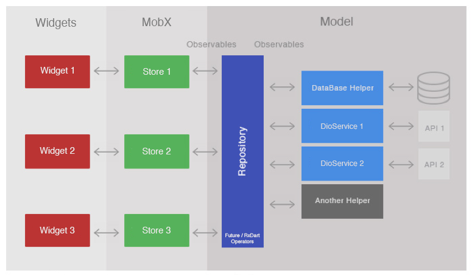

# BBFlutter Task - Flutter Application with JWT Authentication

A Flutter application built on a modern boilerplate architecture featuring **JWT-based authentication** with BuddyBoss and **WordPress REST API integration** for fetching posts. This project implements Clean Architecture principles using MobX and Provider for state management.


## 📋 Table of Contents

- [Features](#-features)
- [Architecture](#-architecture)
- [Key Implementations](#-key-implementations)
  - [JWT Authentication](#1-jwt-authentication-with-buddyboss)
  - [WordPress Posts Fetching](#2-wordpress-posts-fetching)
- [Project Structure](#-project-structure)
- [Getting Started](#-getting-started)
- [API Endpoints](#-api-endpoints)
- [Technologies Used](#-technologies-used)
- [Screenshots](#-screenshots)

## ✨ Features

### Core Features
- 🔐 **JWT-based Authentication** - Secure token-based login with BuddyBoss API
- 📝 **WordPress Posts Integration** - Fetch and display posts from WordPress REST API
- 🎨 **Modern UI/UX** - Clean and responsive design with Material Design
- 🌓 **Dark Mode Support** - System-adaptive dark/light theme
- 🌐 **Multilingual Support** - Internationalization (i18n) ready
- 📱 **Cross-platform** - Supports iOS, Android, Web, Windows, macOS, and Linux

### Technical Features
- ♻️ **Clean Architecture** - Separation of concerns with domain, data, and presentation layers
- 🔄 **Reactive State Management** - MobX for efficient state handling
- 💾 **Local Data Persistence** - SharedPreferences and Sembast database
- 🌐 **RESTful API Integration** - Dio client with interceptors
- 🔧 **Dependency Injection** - GetIt for service locator pattern
- ✅ **Form Validation** - Real-time input validation
- 🎯 **Error Handling** - Comprehensive exception handling
- 📊 **Code Generation** - Automated code generation with build_runner

## 🏗️ Architecture

This project follows **Clean Architecture** principles with clear separation between layers:

```
┌─────────────────────────────────────────────────────────────┐
│                      Presentation Layer                      │
│  (UI Screens, Widgets, Stores/State Management)             │
└──────────────────────┬──────────────────────────────────────┘
                       │
                       ▼
┌─────────────────────────────────────────────────────────────┐
│                       Domain Layer                           │
│  (Entities, Use Cases, Repository Interfaces)               │
└──────────────────────┬──────────────────────────────────────┘
                       │
                       ▼
┌─────────────────────────────────────────────────────────────┐
│                        Data Layer                            │
│  (Repository Implementations, Data Sources, API Clients)    │
└─────────────────────────────────────────────────────────────┘
```

**Architecture Diagram:**



### Layer Responsibilities

- **Presentation Layer**: UI components, state management (MobX stores), and user interactions
- **Domain Layer**: Business logic, entities, use cases, and repository contracts
- **Data Layer**: API calls, local database, shared preferences, and repository implementations

## 🚀 Key Implementations

### 1. JWT Authentication with BuddyBoss

Implemented secure JWT token-based authentication using the BuddyBoss API.

#### Features:
- ✅ Login with username/password
- ✅ Access token and refresh token handling
- ✅ Token persistence in SharedPreferences
- ✅ User data caching (display name, email, user ID)
- ✅ Form validation with real-time feedback
- ✅ Error handling with user-friendly messages

#### Authentication Flow:

```dart
// Endpoint: /wp-json/buddyboss-app/auth/v2/jwt/login
POST request with form data:
{
  "username": "user@example.com",
  "password": "password123"
}

// Response:
{
  "access_token": "eyJ0eXAiOiJKV1QiLCJhbGciOiJIUzI1NiJ9...",
  "refresh_token": "eyJ0eXAiOiJKV1QiLCJhbGciOiJIUzI1NiJ9...",
  "user_display_name": "John Doe",
  "user_nicename": "johndoe",
  "user_email": "user@example.com",
  "user_id": "2"
}
```

#### Implementation Highlights:

**User Entity** (`lib/domain/entity/user/user.dart`):
- Stores user data and JWT tokens
- JSON serialization with `json_serializable`
- Factory method for JWT response conversion

**Login Use Case** (`lib/domain/usecase/user/login_usecase.dart`):
- Clean separation of business logic
- Reusable login parameters

**Repository Implementation** (`lib/data/repository/user/user_repository_impl.dart`):
- Form data POST request to BuddyBoss API
- JWT response parsing and validation
- Automatic token persistence
- Comprehensive error handling

### 2. WordPress Posts Fetching

Integrated WordPress REST API to fetch and display posts with author information.

#### Features:
- ✅ Fetch posts from WordPress REST API
- ✅ Display post title, excerpt, and content
- ✅ Author information with avatars
- ✅ Embedded author details (`_embed=true`)
- ✅ Date formatting (relative time)
- ✅ HTML content stripping
- ✅ Pagination support (20 posts per page)
- ✅ Card-based modern UI

#### API Integration:

```dart
// Endpoint: /wp-json/wp/v2/posts
GET /wp-json/wp/v2/posts?per_page=20&page=1&order=desc&orderby=date&_embed=true
```

#### Implementation Highlights:

**Post Entity** (`lib/domain/entity/post/post.dart`):
- Complete WordPress post structure
- Author details embedded support
- HTML content parsing (title, content, excerpt)
- Legacy compatibility

**Post API** (`lib/data/network/apis/posts/post_api.dart`):
- Dio client integration
- Error handling and logging

**Post UI** (`lib/presentation/post/post_list.dart`):
- MobX reactive state management
- Card-based list view
- Author avatar display
- HTML tag stripping
- Relative date formatting (e.g., "2d ago", "5h ago")
- Error state handling

**UI Features:**
- Author avatar with fallback icon
- Post title (bold, 2-line ellipsis)
- Post excerpt (5-line preview)
- Author name and publish date
- Loading indicator
- Error messages with Flushbar

## 📁 Project Structure

```
lib/
├── constants/           # App-wide constants
│   ├── app_theme.dart
│   ├── assets.dart
│   ├── colors.dart
│   ├── dimens.dart
│   └── strings.dart
│
├── core/               # Core functionality
│   ├── data/          # Core data models
│   ├── domain/        # Core domain logic
│   ├── extensions/    # Dart extensions
│   ├── stores/        # Core stores (form, error, etc.)
│   └── widgets/       # Reusable widgets
│
├── data/              # Data layer
│   ├── di/           # Data dependency injection
│   ├── local/        # Local data sources (database)
│   ├── network/      # Network layer (API clients, Dio)
│   ├── repository/   # Repository implementations
│   └── sharedpref/   # SharedPreferences helper
│
├── di/               # Dependency injection setup
│   └── service_locator.dart
│
├── domain/           # Domain layer (business logic)
│   ├── di/          # Domain dependency injection
│   ├── entity/      # Domain entities (User, Post, etc.)
│   ├── repository/  # Repository interfaces
│   └── usecase/     # Use cases (login, fetch posts, etc.)
│
├── presentation/     # Presentation layer (UI)
│   ├── di/          # Presentation dependency injection
│   ├── home/        # Home screen
│   ├── login/       # Login screen and store
│   ├── post/        # Posts screen and store
│   └── my_app.dart  # Root app widget
│
├── utils/           # Utilities
│   ├── device/      # Device utilities
│   ├── dio/         # Dio configuration
│   ├── locale/      # Localization
│   └── routes/      # Route definitions
│
└── main.dart        # App entry point
```

## 🎯 Getting Started

### Prerequisites

- Flutter SDK: `>=3.0.6 <4.0.0`
- Dart SDK: `>=3.0.6`
- IDE: Android Studio, VS Code, or IntelliJ IDEA

### Installation

1. **Clone the repository:**
   ```bash
   git clone https://github.com/yourusername/BBFlutterTask.git
   cd BBFlutterTask
   ```

2. **Install dependencies:**
   ```bash
   flutter pub get
   ```

3. **Run code generation:**
   ```bash
   flutter packages pub run build_runner build --delete-conflicting-outputs
   ```
   
   Or use watch mode for continuous generation:
   ```bash
   flutter packages pub run build_runner watch
   ```

4. **Configure API endpoint:**
   
   Update the base URL in `lib/data/network/constants/endpoints.dart`:
   ```dart
   static const String baseUrl = "https://your-wordpress-site.com";
   ```

5. **Run the app:**
   ```bash
   flutter run
   ```

### Test Credentials

For testing purposes, use your WordPress/BuddyBoss credentials:
- **Username**: Your WordPress username or email
- **Password**: Your WordPress password

## 🌐 API Endpoints

| Endpoint | Method | Description |
|----------|--------|-------------|
| `/wp-json/buddyboss-app/auth/v2/jwt/login` | POST | JWT authentication login |
| `/wp-json/wp/v2/posts` | GET | Fetch WordPress posts |

### Base URL
```
https://st2-nayeem.hz2.developbb.dev
```

## 🛠️ Technologies Used

### Core
- **Flutter** - UI framework
- **Dart** - Programming language

### State Management
- **MobX** - Reactive state management
- **Provider** - Dependency injection and state management

### Networking
- **Dio** - HTTP client for API calls
- **REST Client** - Custom REST client wrapper

### Local Storage
- **SharedPreferences** - Key-value storage for user data and tokens
- **Sembast** - NoSQL database for local data persistence

### Code Generation
- **build_runner** - Code generation tool
- **json_serializable** - JSON serialization
- **mobx_codegen** - MobX code generation

### Dependency Injection
- **GetIt** - Service locator pattern

### UI/UX
- **Google Fonts** - Custom typography
- **another_flushbar** - Elegant notifications
- **Material Design** - UI components

### Utilities
- **validators** - Form validation
- **xxtea** - Encryption
- **intl** - Internationalization
- **event_bus** - Event management

## 🎨 Screenshots

### Login Screen
- Clean login form with email and password fields
- Real-time form validation
- Loading indicator during authentication
- Error messages with Flushbar

### Posts Screen
- Grid/List view of WordPress posts
- Author avatars and information
- Post excerpt preview
- Relative date formatting
- Pull-to-refresh functionality

## 📝 Code Generation Files

This project uses code generation for:
- **MobX stores** (`*.g.dart`)
- **JSON serialization** (`*.g.dart`)
- **Dependency injection** (`*.inject.dart`)

### Hide Generated Files (Optional)

**Android Studio / IntelliJ IDEA:**
1. Go to `Preferences` → `Editor` → `File Types`
2. Under "Ignore files and folders", add:
   ```
   *.inject.summary;*.inject.dart;*.g.dart;
   ```

**Visual Studio Code:**
1. Go to `Preferences` → `Settings`
2. Search for "Files: Exclude"
3. Add patterns:
   ```
   **/*.inject.summary
   **/*.inject.dart
   **/*.g.dart
   ```

## 🔧 Configuration

### Timeouts
Configure API timeouts in `lib/data/network/constants/endpoints.dart`:
```dart
static const int receiveTimeout = 15000;      // 15 seconds
static const int connectionTimeout = 30000;   // 30 seconds
```

### Theme
Customize app theme in `lib/constants/app_theme.dart`

### Localization
Add translations in `assets/lang/`:
- `en.json` - English
- `es.json` - Spanish
- `da.json` - Danish

## 🧪 Testing

Run tests:
```bash
flutter test
```

## 📱 Supported Platforms

- ✅ Android
- ✅ iOS
- ✅ Web
- ✅ Windows
- ✅ macOS
- ✅ Linux

## 🔐 Security Features

- JWT token-based authentication
- Secure token storage in SharedPreferences
- Password encryption with XXTEA
- Network security configuration
- Error message sanitization

## 🤝 Contributing

This is a forked project with custom implementations. Contributions are welcome!

1. Fork the repository
2. Create your feature branch (`git checkout -b feature/amazing-feature`)
3. Commit your changes (`git commit -m 'Add some amazing feature'`)
4. Push to the branch (`git push origin feature/amazing-feature`)
5. Open a Pull Request

## 📄 License

This project is licensed under the MIT License - see the [LICENSE](LICENSE) file for details.

## 🙏 Acknowledgments

- **Original Boilerplate**: [flutter-boilerplate-project](https://github.com/zubairehman/flutter-boilerplate-project) by [@zubairehman](https://github.com/zubairehman)
- **BuddyBoss** - For the JWT authentication API
- **WordPress** - For the REST API
- **Dev** - nYm


## 📞 Contact

For questions or support, please open an issue in the repository.

---

**Built with ❤️ using Flutter**
